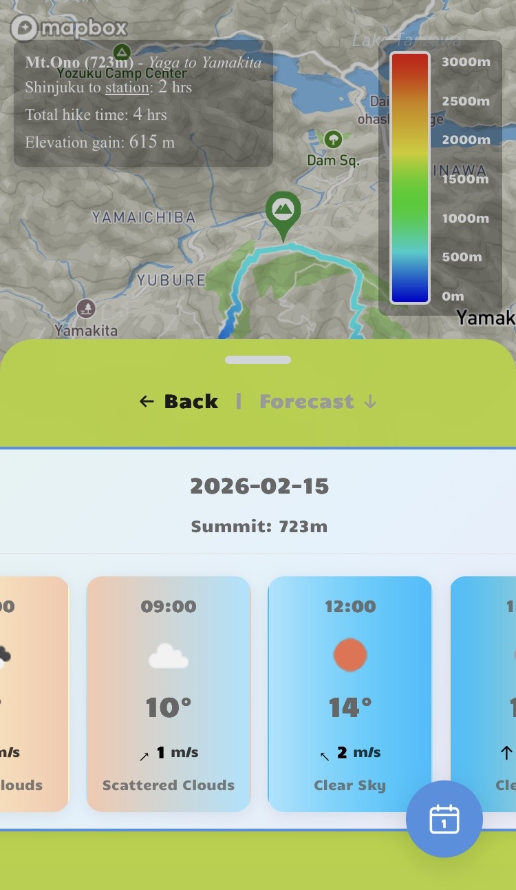
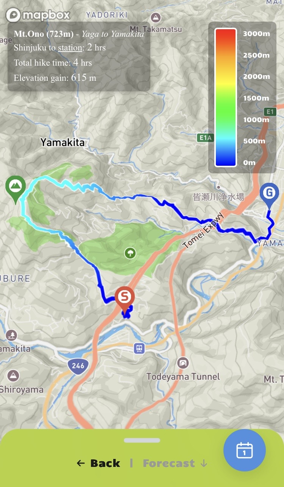
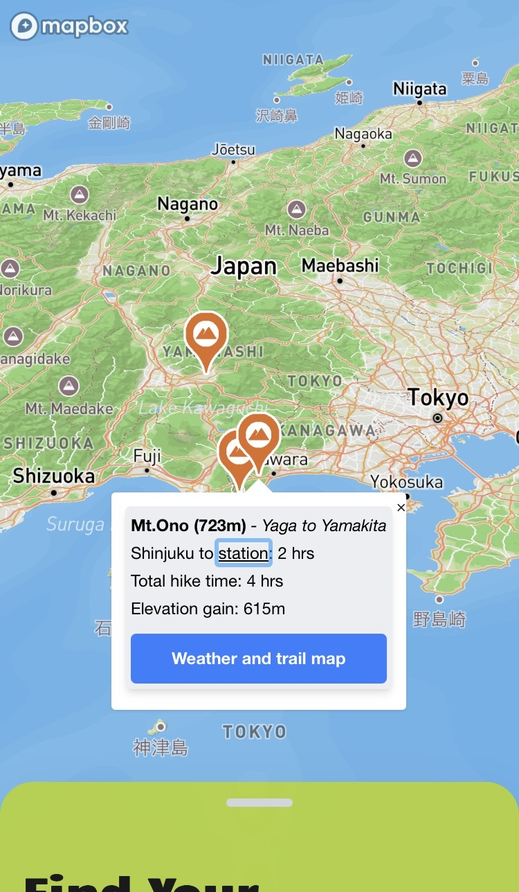
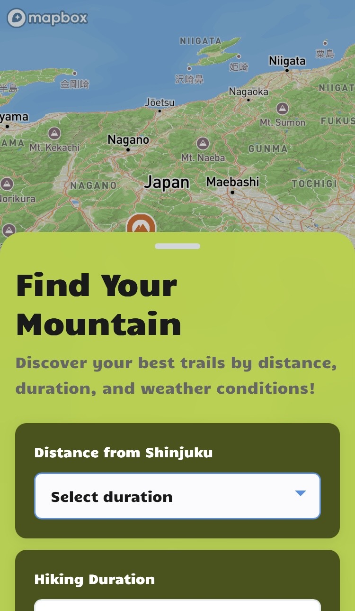

# GeoYama 🗻

  
  
  
  

外国人旅行者向けの日本登山ガイドアプリ  
デモ：https://geoyama.vercel.app/

新宿から日帰りで行ける山を探せる、直感的なマップベースの登山情報サービス

---

## 概要

フロントエンドのUI/UXだけでなく、API設計やデータベース設計も含めた**フルスタック開発の実践**として作成しました。

自分の好きな登山を題材に、「実際に使いたい」と思える体験をベースに機能設計しています。

**ターゲット**: 登山好きな外国人旅行者

日本の山に馴染みのない方でも、直感的な操作で行き先を絞れるよう、情報の見せ方と操作性を重視しています。

※ GPXデータは実際に歩いたルートを使用しているため、掲載できる山はまだ限られています。今後はoverpass turboなどを活用して、より多くの山をカバーしていく予定です。

---

## 技術スタック

| カテゴリ | 技術 |
|---------|------|
| フロントエンド | Next.js 16 / React 19 |
| 言語 | TypeScript 5 |
| バックエンド | Next.js API Routes (Node.js) |
| データベース | SQLite / Prisma |
| 地図 | Mapbox GL JS |
| 状態管理 | Zustand |
| スタイリング | Tailwind CSS 4 |
| 日付処理 | Day.js |
| テスト | Jest / Testing Library |
| リンター | ESLint 9 |

---

## 主な機能

- 山の検索・フィルター
- 各山の詳細情報（距離・標高・難易度など）
- トレイルルートの地図表示（GeoJSON対応）
- 駐車場・最寄り駅情報
- 天気情報の表示
- ログイン・山お気に入り機能

## 今後追加予定の機能

- 多言語対応（英語・中国語など）
- アクセスガイド（駅・バス停から登山口まで）
- 難易度・危険箇所の可視化
- ユーザー投稿型の写真・レビュー
- オフライン地図対応

---

## バックエンド / データ設計

Next.jsのAPIルート

- API経由でのデータ取得・処理
- 環境変数を用いた外部APIキーの管理
- Prismaによるリレーショナルデータベース設計

### データベース設計

- User / Mountain / MountainGallery / UserFavorite のリレーション構造
- 中間テーブルによるお気に入り管理（Many-to-Many）
- 重複登録防止のためのユニーク制約

## データ構成

- Prisma ORMによるスキーマ管理
- 山情報・ユーザー情報・ギャラリー画像などをDBで管理
- ルート情報はGeoJSON形式で保存

---

## 技術的なポイント

| テーマ | 内容 |
|--------|------|
| Map × React統合 | MapboxのライフサイクルとReactの同期 |
| 状態管理 | Zustandによるシンプルかつ拡張しやすい構成 |
| データ処理 | GPX → GeoJSON変換 |
| レスポンシブ | モバイル横向き対応 |

---

# GeoYama 🗻

A hiking guide app in Japan designed for foreign travelers  
Demo: https://geoyama.vercel.app/

An intuitive map-based service to discover day-trip mountains from Shinjuku

---

## Overview

This project was built as a **full-stack application**, covering not only frontend UI/UX but also API design and database modeling.

It is based on my personal interest in hiking, with a focus on building features that I would genuinely want to use.

**Target Users**: Foreign travelers who enjoy hiking

The app is designed to help users who are unfamiliar with Japanese mountains quickly narrow down their options through intuitive interaction and well-structured information.

*Note: GPX data is based on trails I have personally hiked, so the number of available mountains is currently limited. In the future, I plan to expand coverage using tools like Overpass Turbo.*

---

## Tech Stack

| Category | Technology |
|----------|------------|
| Frontend | Next.js 16 / React 19 |
| Language | TypeScript 5 |
| Backend | Next.js API Routes (Node.js) |
| Database | SQLite / Prisma |
| Map | Mapbox GL JS |
| State Management | Zustand |
| Styling | Tailwind CSS 4 |
| Date Handling | Day.js |
| Testing | Jest / Testing Library |
| Linting | ESLint 9 |

---

## Features

- Mountain search and filtering
- Detailed mountain information (distance, elevation, difficulty, etc.)
- Trail route visualization using GeoJSON
- Parking and nearest station information
- Weather information display
- User authentication and favorite/bookmark feature

---

## Planned Features

- Multi-language support (English, Chinese, etc.)
- Access guides (from station/bus stop to trailhead)
- Visualization of difficulty and hazardous areas
- User-generated photos and reviews
- Offline map support

---

## Backend & Data Design

Using Next.js API routes to separate client and server responsibilities:

- Data fetching and processing via API routes
- Secure management of external API keys using environment variables
- Relational database design with Prisma

### Database Design

- Structured relationships: User / Mountain / MountainGallery / UserFavorite
- Many-to-many relationship for favorites via intermediate table
- Unique constraints to prevent duplicate entries

---

## Data Structure

- Schema management using Prisma ORM
- Mountain data, user data, and gallery images stored in the database
- Route data stored in GeoJSON format

---

## Technical Highlights

| Area | Details |
|------|--------|
| Map × React Integration | Synchronizing Mapbox lifecycle with React |
| State Management | Scalable and simple state design using Zustand |
| Data Processing | GPX to GeoJSON conversion |
| Responsive Design | Mobile landscape support |
