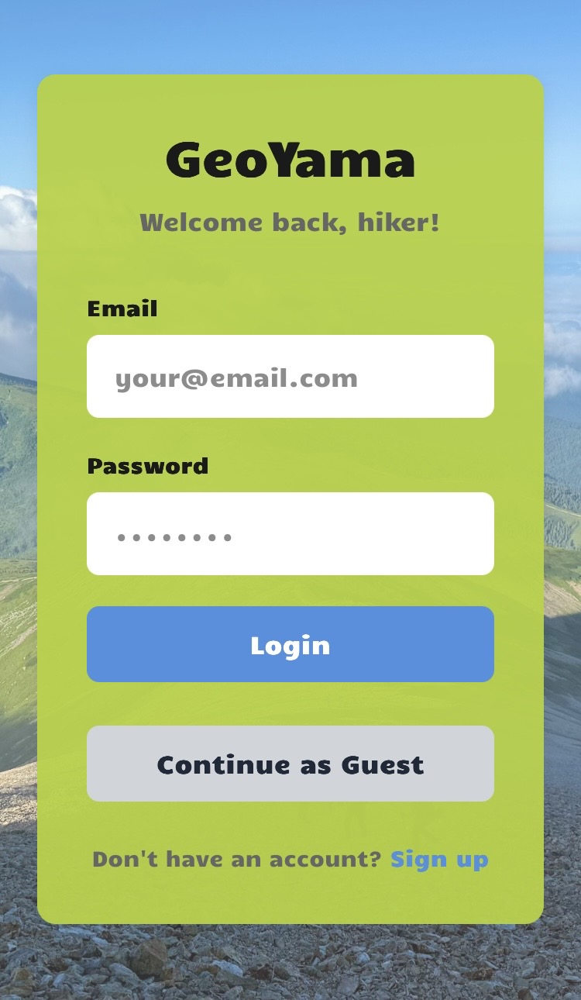
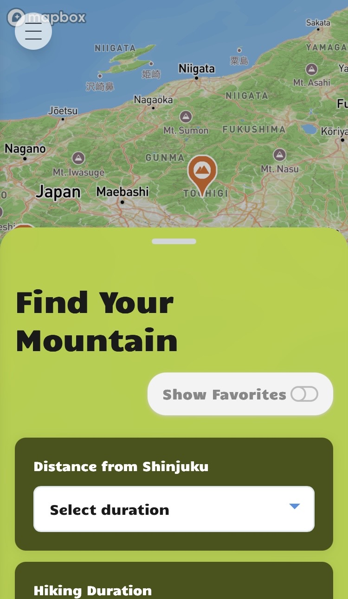
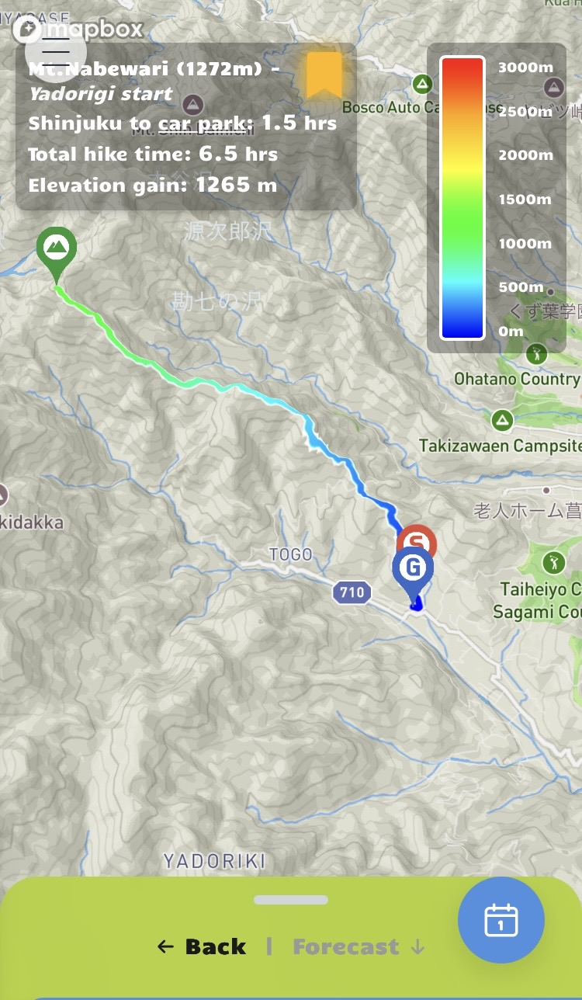

# GeoYama 🗻

外国人旅行者向けの日本登山ガイドアプリ  
デモ：https://geoyama.vercel.app/

新宿から日帰りで行ける山を探せる、直感的なマップベースの登山情報サービス

---

ログイン後は、お気に入り登録した山のみ表示することが可能です

  
  
  
お気に入り登録済みの山はボタンが黄色く光ります

  

ゲストで利用の場合は、お気に入り登録機能はありません

  
  
  
  

---

## 概要

フロントエンドのUI/UXだけでなく、API設計やデータベース設計も含めた**フルスタック開発の実践**として作成しました。

自分の好きな登山を題材に、「実際に使いたい」と思える体験をベースに機能設計しています。

**ターゲット**: 登山好きな外国人旅行者

日本の山に馴染みのない方でも、直感的な操作で行き先を絞れるよう、情報の見せ方と操作性を重視しています。

※ GPXデータは実際に歩いたルートを使用しているため、掲載できる山はまだ限られています。今後はoverpass turboなどを活用して、より多くの山をカバーしていく予定です。

---

## 技術スタック

| カテゴリ | 技術 |
|---------|------|
| フロントエンド | Next.js 16 / React 19 |
| 言語 | TypeScript 5 |
| バックエンド | Next.js API Routes (Node.js) |
| データベース | PostgreSQL (Neon) / Prisma |
| 地図 | Mapbox GL JS |
| 状態管理 | Zustand |
| スタイリング | Tailwind CSS 4 |
| 日付処理 | Day.js |

---

## 主な機能

- ログイン認証・山のお気に入り機能
- 山の検索・フィルター
- 各山の詳細情報（距離・標高・難易度など）
- トレイルルートの地図表示（GeoJSON対応）
- 駐車場・最寄り駅情報
- 天気情報の表示

## 今後追加予定の機能

- 多言語対応（英語・中国語など）
- アクセスガイド（駅・バス停から登山口まで）
- 難易度・危険箇所の可視化

---

## バックエンド / データ設計

Next.jsのAPIルート

- API経由でのデータ取得・処理
- 環境変数を用いた外部APIキーの管理
- Prismaによるリレーショナルデータベース設計

### データベース設計

- User / Mountain / MountainGallery / UserFavorite のリレーション構造
- 中間テーブルによるお気に入り管理（Many-to-Many）
- 重複登録防止のためのユニーク制約

## データ構成

- Prisma ORMによるスキーマ管理
- 山情報・ユーザー情報・ギャラリー画像などをDBで管理
- ルート情報はGeoJSON形式で保存
- UI側はAPIから必要なデータを取得して一意の値（routeKey）でルートを特定

---

# GeoYama 🗻

A hiking guide app in Japan designed for foreign travelers  
Demo: https://geoyama.vercel.app/

An intuitive map-based service to discover day-trip mountains from Shinjuku

---

After logging in, you can display only your favorited mountains.

  
  
  
Favorited mountains are highlighted in yellow.

  

If you use the app as a guest, the favorite feature is not available.

  
  
  
  

---

## Overview

This project was built as a **full-stack application**, covering not only frontend UI/UX but also API design and database modeling.

It is based on my personal interest in hiking, with a focus on building features that I would genuinely want to use.

**Target Users**: Foreign travelers who enjoy hiking

The app is designed to help users who are unfamiliar with Japanese mountains quickly narrow down their options through intuitive interaction and well-structured information.

*Note: GPX data is based on trails I have personally hiked, so the number of available mountains is currently limited. In the future, I plan to expand coverage using tools like Overpass Turbo.*

---

## Tech Stack

| Category | Technology |
|----------|------------|
| Frontend | Next.js 16 / React 19 |
| Language | TypeScript 5 |
| Backend | Next.js API Routes (Node.js) |
| Database | PostgreSQL (Neon) / Prisma |
| Map | Mapbox GL JS |
| State Management | Zustand |
| Styling | Tailwind CSS 4 |
| Date Handling | Day.js |

---

## Main Features

- User authentication and mountain favorite feature
- Mountain search and filtering
- Display only favorited mountains after login
- Detailed mountain information (distance, elevation, difficulty, etc.)
- Trail route visualization (GeoJSON supported)
- Parking and nearest station information
- Weather information display

## Features for Guests

- Favorite feature is not available for guests

---

## Planned Features

- Multi-language support (English, Chinese, etc.)
- Access guides (from station/bus stop to trailhead)
- Visualization of difficulty and hazardous areas

---

## Backend / Data Design

Next.js API routes

- Data fetching and processing via API routes
- Secure management of external API keys using environment variables
- Relational database design with Prisma

### Database Design

- User / Mountain / MountainGallery / UserFavorite relational structure
- Many-to-many relationship for favorites via intermediate table
- Unique constraints to prevent duplicate entries

## Data Structure

- Schema management using Prisma ORM
- Mountain data, user data, and gallery images stored in the database
- Route data stored in GeoJSON format
- The UI fetches data from the API and identifies routes by a unique value (routeKey)

---

## Technical Highlights

| Area | Details |
|------|--------|
| Map × React Integration | Synchronizing Mapbox lifecycle with React |
| State Management | Scalable and simple state design using Zustand |
| Data Processing | GPX to GeoJSON conversion |
| Responsive Design | Mobile landscape support |
