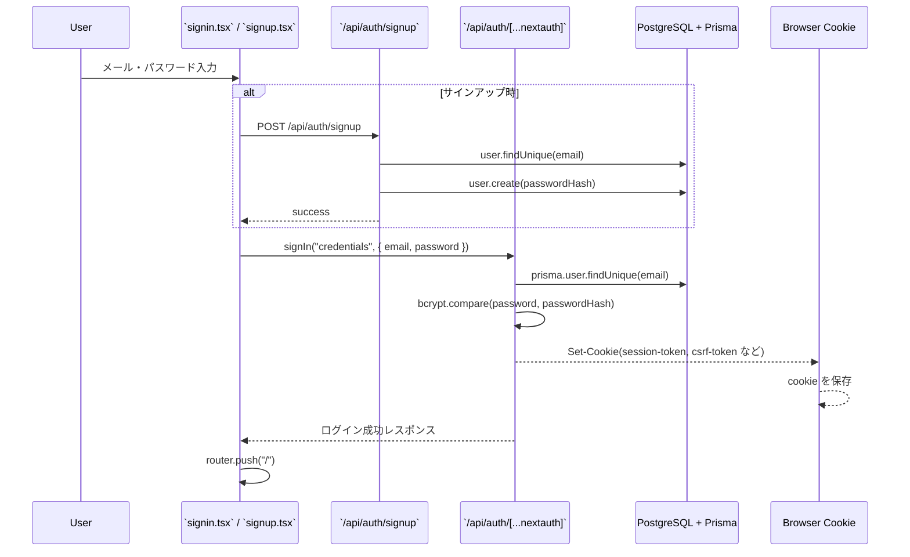
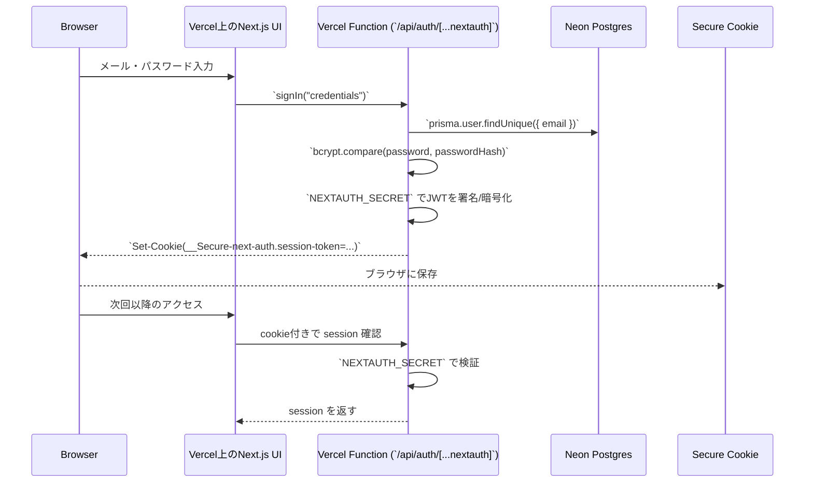

# 認証フローまとめ

実装は **NextAuth + CredentialsProvider + Prisma + bcrypt + JWT session** で構成。公式ドキュメント（https://next-auth.js.org/getting-started/example）参照。
---

## NextAuth の大事なポイント

- **NEXTAUTH_SECRET**: JWTの署名・暗号化に使う秘密鍵。ローカル開発でも必須。安全なランダム文字列をenv.localに入れておく。
- **NEXTAUTH_URL**: 本番環境のURL。URL生成やコールバックで役立つ。開発環境では `http://localhost:3000` でOK。Vercel では自動で設定されるため環境変数に入れなくても動くが、明示的に入れておくとロゴやURL生成で正しいURLが使われる。


## 1. 認証のポイント
pages/api/auth/[...nextauth].ts

- **認証方法**: メールアドレス + パスワード（CredentialsProvider）
- **ユーザー確認**: `Prisma` でDBからユーザー取得（`prisma.user.findUnique()`）開発時はDocker起動忘れずに
- **パスワード検証**: `bcrypt.compare()` でハッシュ化されたパスワードと照合
- **ログイン状態の維持**: `NextAuth` の **JWT session**（`session: { strategy: "jwt" }`）
- **保存先**: ブラウザの **cookie**（NextAuth が内部で `Set-Cookie` を返す）
- **セッションの利用**: `useSession()` で React コンポーネントからログイン状態を参照
- **セッションのサーバー側での利用**: `getServerSession()` でsession.userを取得することでフロントからidなどを渡さずにユーザー情報を参照できる

> 重要: アプリ側で `document.cookie = ...` のような処理は書いていない。  
> `authorize()` が成功したあと、**NextAuth が内部で `Set-Cookie` を返し、ブラウザが自動保存**する。確認方法は後述。

---

## 2. 関連ファイルと役割

| ファイル | 役割 |
|---|---|
| `src/pages/signup.tsx` | サインアップ画面。`/api/auth/signup` を呼んで新規登録し、その後 `signIn("credentials")` で自動ログイン |
| `src/pages/signin.tsx` | ログイン画面。`signIn("credentials")` を実行 |
| `src/pages/api/auth/signup.ts` | ユーザー新規作成API。`bcrypt.hash()` でハッシュ化してDB保存 |
| `src/pages/api/auth/[...nextauth].ts` | NextAuth 設定本体。Credentials認証、JWT session、session callback を定義 |
| `src/pages/_app.tsx` | `SessionProvider` を通して `useSession()` を全体で使えるようにする |
| `src/lib/prisma.ts` | Prisma Client を作成し、PostgreSQL に接続 |

---

## 3. 認証の全体像

### 3-1. 本人確認（Authentication）
`email` と `password` が正しいかを確認する段階

実際に行っているコードは `src/pages/api/auth/[...nextauth].ts` の `authorize()` 

```ts
const user = await prisma.user.findUnique({
  where: { email: credentials?.email },
});

const isPasswordValid = await bcrypt.compare(
  credentials.password,
  user.passwordHash, // DBに保存されているハッシュ化されたパスワード
);
```

### 3-2. ログイン状態の維持（Session Management）
認証に成功したあと、NextAuth が **JWTベースのセッション**を発行し、cookie に保持。

```ts
session: {
  strategy: "jwt",
},
```

---

## 4. ログインフロー図



---

## 5. なぜ cookie に保存されるのか

**cookie 保存は NextAuth の内部実装**で行われているため、アプリ側で `document.cookie = ...` のようなコードは書かない。

1. `signIn("credentials")` を呼ぶ
2. `authorize()` が成功して `user` を返す

その後は NextAuth が内部で以下を行う。

3. JWT session token を生成
4. HTTPレスポンスに `Set-Cookie` ヘッダーを付与
5. ブラウザが cookie として保存
6. 次回以降のリクエストで cookie が自動的に送信される

つまり、**cookie に保存するコードはフレームワーク側が担当**している。

---

## 6. `useSession()` は何をしているのか

`src/pages/_app.tsx` では以下のように `SessionProvider` を使う。※公式推奨

```tsx
<SessionProvider session={session}>
  <Component {...pageProps} />
</SessionProvider>
```

これにより、各コンポーネントで `useSession()` が使えるようになる。

`useSession()` の役割は:

- 既に保存されている session cookie をもとに
- NextAuth の session API から現在のログイン状態を取得し
- `session`, `status` としてReactで簡単にユーザー情報を参照できるようにする

> つまり `useSession()` は **保存する側ではなく、読む側** 。

---

## 7. サインアップ時の流れ

`src/pages/signup.tsx` では、以下の2段階で動いている。

### 7-1. ユーザー登録

```ts
const res = await fetch("/api/auth/signup", {
  method: "POST",
  headers: { "Content-Type": "application/json" },
  body: JSON.stringify({ email, password, name: email.split("@")[0] }),
});
```

### 7-2. 登録成功後に自動ログイン

```ts
await signIn("credentials", {
  email,
  password,
  redirect: false,
});
router.push("/");
```

つまり **「登録」と「ログイン」は別処理** 。

- 新規作成: `signup.ts`
- 認証・セッション発行: `[...nextauth].ts`

---

## 8. 実際に保存される cookie の例

NextAuth は認証成功後、以下のような cookie をブラウザに保存する。

- `next-auth.csrf-token`
- `next-auth.callback-url`
- `next-auth.session-token`
- 本番環境では `__Secure-next-auth.session-token`

意味の例:

| Cookie名 | 用途 |
|---|---|
| `next-auth.csrf-token` | CSRF対策 |
| `next-auth.callback-url` | ログイン後の遷移先 |
| `next-auth.session-token` | ログイン状態の本体（JWT session） |

---

## 9. 確認方法

### 9-1. DevTools の `Application` タブで確認

1. ブラウザでログインする
2. DevTools を開く
3. `Application` → `Cookies` → `http://localhost:3000`
4. `next-auth` で始まる cookie を探す

> `next-auth.session-token` があれば、JWT session が cookie に保存されていることが確認できる。

### 9-2. `Network` タブで確認

ログイン時のリクエストを確認できる。

- `/api/auth/callback/credentials`
- `/api/auth/session`

とくに `callback/credentials` のレスポンスヘッダーで:

```http
Set-Cookie: next-auth.session-token=...
```

が見えれば、**そのレスポンスで cookie が保存された**と分かる。

### 9-3. DB接続エラーの確認

開発時、デスクトップ環境で Docker / PostgreSQL が止まっていると、`prisma.user.findUnique()` で失敗する。
その場合はフロントで `Signup failed` が見えても、根本原因は API 側のDB接続エラー。

### 9-4. 本番環境（Vercel + Neon）の認証フロー

開発環境ではローカルの Next.js + Docker/PostgreSQL を使うが、**本番では「APIの実行場所が Vercel」「DB が Neon」になる**だけで、認証の仕組み自体はほぼ同じ。



本番でのポイント:

- **UI / API は Vercel 上**で動く
- **ユーザー情報の参照先は Neon**
- `session: { strategy: "jwt" }` のため、**session本体は Neon ではなく cookie / JWT にある**
- HTTPS の本番環境では `__Secure-next-auth.session-token` のような名前になりやすい

### 9-5. 本番環境の環境変数の役割

| 変数名 | 役割 | 使われ方 |
|---|---|---|
| `NEXTAUTH_SECRET` | JWT / session cookie の署名・暗号化・検証に使う秘密鍵 | `NextAuth()` の内部処理で利用 |
| `DATABASE_URL` | Prisma が Neon Postgres に接続するための接続文字列 | `src/lib/prisma.ts` と `prisma.config.ts` で利用 |
| `NEXTAUTH_URL`（任意/推奨） | 本番の公開URL。URL生成やコールバックで役立つ | NextAuth のURL解決で利用 |

> 注意: コード上で参照しているのは `process.env.DATABASE_URL` です。  
> そのため Vercel の環境変数名は **`DATABASE_URL`** が正しく、`DETABASE_URL` だと Prisma は読めません。

### 9-6. 本番でログイン時に実際に起きること

1. ユーザーが Vercel 上の `signin.tsx` でログインする  
2. `signIn("credentials")` が Vercel の `/api/auth/[...nextauth]` を呼ぶ  
3. API が `DATABASE_URL` を通して Neon に接続し、ユーザーを取得する  
4. `bcrypt.compare()` でパスワードが正しければ、NextAuth が `NEXTAUTH_SECRET` で session token を生成する  
5. その token が `Set-Cookie` ヘッダーとしてブラウザに返される  
6. 以後のアクセスでは、ブラウザがその cookie を自動送信し、`useSession()` がログイン状態を読める

### 9-7. 本番で確認するポイント

- Vercel の Environment Variables に **`NEXTAUTH_SECRET`** と **`DATABASE_URL`** が入っているか
- `DATABASE_URL` が Neon の接続文字列になっているか
- ログイン後、ブラウザの DevTools で `__Secure-next-auth.session-token` もしくは `next-auth.session-token` が見えるか
- Vercel の Function Logs に `prisma.user.findUnique()` の接続失敗が出ていないか

---

## 10. 今の構成のメリット

- 実装が比較的シンプル
- DBに session テーブルを持たなくてよい
- `useSession()` でReact側から扱いやすい
- `CredentialsProvider` なので学習しやすい

---

## 11. 今後の拡張アイデア

### 11-1. JWT に追加情報を入れる
たとえば `role` や `userId` を token に載せたい場合は、`callbacks.jwt` を追加します。

```ts
callbacks: {
  async jwt({ token, user }) {
    if (user) {
      token.id = user.id;
    }
    return token;
  },
  async session({ session, token }) {
    if (session.user && token.sub) {
      session.user.id = token.sub;
    }
    return session;
  },
}
```

### 11-2. 保護されたページを作る
- `useSession()` でクライアント側保護
- `getServerSession()` でサーバー側保護
- API Route でもセッション確認を入れる

### 11-3. DB session方式に変更する
Prisma Adapter を導入すると、JWTではなくDBに session を保存する方式にもできる。

### 11-4. OAuthログイン追加
Google / GitHub ログインを増やす場合も、NextAuth なら provider を追加するだけで拡張しやすい。

### 11-5. セキュリティ強化
- メール認証
- パスワード再設定
- レートリミット
- ログイン失敗回数制御
- バリデーション強化

---

## 12. まとめ

1. `signin.tsx` / `signup.tsx` から `signIn("credentials")` を呼ぶ  
2. `[...nextauth].ts` の `authorize()` が DB と `bcrypt` で本人確認する  
3. 認証成功後、**NextAuth が JWT session を cookie に保存する**  
4. `useSession()` がそのログイン状態を読み取る  
5. 本番ではこの処理を **Vercel（API実行） + Neon（ユーザーDB） + Secure Cookie（session保持）** で実現している  

という流れ。

---

## 13. 参考: 現在のコード上の責務整理

- **ユーザー登録**: `src/pages/api/auth/signup.ts`
- **ログイン認証**: `src/pages/api/auth/[...nextauth].ts`
- **ログイン画面UI**: `src/pages/signin.tsx`
- **サインアップ画面UI**: `src/pages/signup.tsx`
- **セッション利用**: `src/pages/_app.tsx` + `useSession()`

---

