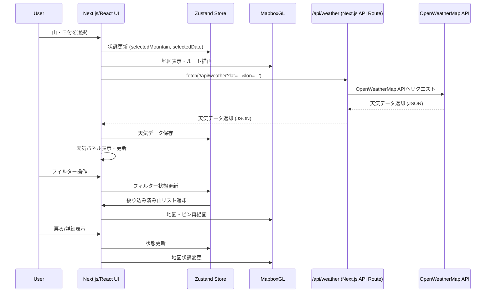

# データ遷移・APIシーケンス図

---



---
# 認証フローを含む

```mermaid

sequenceDiagram
    participant User
    participant UI as Next.js/React UI
    participant Store as Zustand Store
    participant Map as MapboxGL
    participant API as /api/weather, /api/auth, /api/favorite
    participant OWM as OpenWeatherMap API
    participant DB as DB/Storage

    User->>UI: 山・日付を選択
    UI->>Store: 状態更新 (selectedMountain, selectedDate)
    UI->>Map: 地図表示・ルート描画
    UI->>API: fetch('/api/weather?lat=...&lon=...')
    API->>OWM: OpenWeatherMap APIへリクエスト
    OWM-->>API: 天気データ返却 (JSON)
    API-->>UI: 天気データ返却 (JSON)
    UI->>Store: 天気データ保存
    UI->>UI: 天気パネル表示・更新
    User->>UI: フィルター操作
    UI->>Store: フィルター状態更新
    Store->>UI: 絞り込み済み山リスト返却
    UI->>Map: 地図・ピン再描画
    User->>UI: 戻る/詳細表示
    UI->>Store: 状態更新
    UI->>Map: 地図状態変更

    %% 認証フロー
    User->>UI: ログイン画面で認証情報入力
    UI->>API: fetch('/api/auth', email, password)
    API->>DB: ユーザー認証
    DB-->>API: 認証結果
    API-->>UI: 認証トークン/エラー返却
    UI->>Store: ログイン状態保存

    %% お気に入り機能
    User->>UI: 「お気に入り」ボタン押下
    UI->>Store: ログイン状態確認
    alt ログイン済み
        UI->>API: fetch('/api/favorite', {mountainId, userToken})
        API->>DB: お気に入り追加/削除
        DB-->>API: 更新結果
        API-->>UI: 成功/失敗レスポンス
        UI->>Store: お気に入り状態更新
    else 未ログイン
        UI->>UI: ログイン画面へ遷移
    end