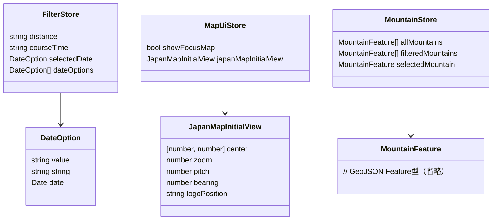

# Zustand Stores データ構造図

```mermaid
classDiagram
    class FilterStore {
      string distance
      string courseTime
      DateOption selectedDate
      DateOption[] dateOptions
    }
    class MapUiStore {
      bool showFocusMap
      JapanMapInitialView japanMapInitialView
    }
    class MountainStore {
      MountainFeature[] allMountains
      MountainFeature[] filteredMountains
      MountainFeature selectedMountain
    }
    class DateOption {
      string value
      string string
      Date date
    }
    class JapanMapInitialView {
      [number, number] center
      number zoom
      number pitch
      number bearing
      string logoPosition
    }
    class MountainFeature {
      // GeoJSON Feature型（省略）
    }
    FilterStore --> DateOption
    MapUiStore --> JapanMapInitialView
    MountainStore --> MountainFeature
```

- FilterStore: フィルター条件や日付選択肢を管理
- MapUiStore: 地図の表示状態や初期ビュー設定を管理
- MountainStore: 山データ・選択中の山・絞り込み結果を管理
